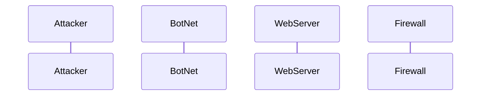

## Documentation
    - A general first step in a DDoS attack involves the attacker compromising various amounts of internet connected devices in order to control them remotely
    - In order to control these devices remotely the attacker infects the devices with malware, then the attacker is able to use a command and control server to instruct the bots. 
    - Once the attacker is ready, the bots will send a numerous amount of individual request.  These request can be real or fake.  This influx of traffic causes the server to become overwhelmed and the server can no longer offer its resources to real users
    - During the attack, the first line of defense begins to block the malicious attacks and filters out the real request from the fake. 
     - Another line of defese once the DDoS has been detected in called blackholing.  This is when all of the sudden traffic to the same IP address is dropped.
